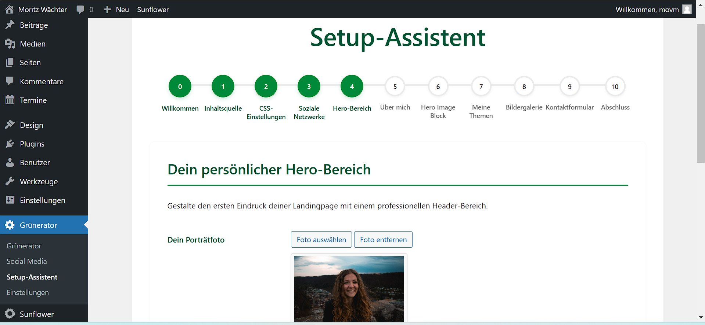

# Grünerator WordPress

Ein WordPress-Plugin, das Dir hilft, professionelle Kandidatenseiten für grüne Kandidierende mit Gutenberg-Blöcken zu erstellen. Entwickelt speziell für das [Sunflower WordPress-Theme](https://github.com/codeispoetry/sunflower).


## 🚀 Features

- Spezielle Gutenberg-Blöcke für Kandidatenseiten
  - Kandidaten-Profil Block
  - Themen-Block
  - Wahlkreis-Block
  - Termine-Block
- Setup-Assistent für schnelle Einrichtung
- Social Media Integration
- Vorgefertigte Block-Patterns für Kandidatenprofile


## Setup-Assistent

Der Setup-Assistent führt Dich Schritt für Schritt durch die Einrichtung Deiner Kandidatenseite:



Nach Abschluss des Setups kannst Du direkt mit der Bearbeitung Deiner Seite beginnen:


## 📋 Anforderungen

- WordPress 5.8 oder höher
- PHP 7.4 oder höher
- Node.js 14+ und npm für Entwicklung
- [Sunflower WordPress-Theme](https://github.com/codeispoetry/sunflower) installiert und aktiviert

## 🔧 Installation

1. Stelle sicher, dass das Sunflower-Theme installiert und aktiviert ist
2. Lade das Plugin herunter
3. Entpacke es in Dein `/wp-content/plugins/` Verzeichnis
4. Aktiviere das Plugin in WordPress
5. Gehe zu "Grünerator" im Admin-Menü

## 💻 Entwicklung

```bash
# Repository klonen
git clone https://github.com/netzbegruenung/gruenerator-wordpress.git
cd gruenerator-wordpress

# Abhängigkeiten installieren
npm install

# Entwicklungs-Build mit Watch-Modus
npm run start

# Produktions-Build
npm run build
```

### Theme-Abhängigkeit

Dieses Plugin erweitert das Sunflower-Theme um zusätzliche Gutenberg-Blöcke und Funktionen. Die Blöcke sind speziell für das Design und die Funktionen des Themes optimiert. Ohne das Sunflower-Theme werden die Blöcke nicht korrekt dargestellt.

### Branch-Struktur

Wir nutzen eine vereinfachte Git-Flow Struktur:

- `main`: Produktions-Code (stabil)
- `develop`: Entwicklungs-Branch (aktuell)
- `feature/*`: Für neue Features (z.B. `feature/kandidaten-profil`)
- `bugfix/*`: Für Fehlerbehebungen (z.B. `bugfix/mobile-ansicht`)

### Commit-Konventionen

Wir nutzen [Conventional Commits](https://www.conventionalcommits.org/):

```
typ(bereich): beschreibung

- Detaillierte Beschreibung (optional)
- Weitere Details (optional)
```

Typen:
- `feat:` Neue Features
- `fix:` Bugfixes
- `docs:` Dokumentationsänderungen
- `style:` Code-Formatierung
- `refactor:` Code-Verbesserungen
- `test:` Test-bezogene Änderungen

Beispiel:
```bash
git commit -m "feat(profil): Füge Lebenslauf-Block hinzu"
```

### Pull Requests

1. Fork das Repository
2. Erstelle einen Feature-Branch (`git checkout -b feature/NeuesFeature`)
3. Committe Deine Änderungen (`git commit -m 'feat: Füge neues Feature hinzu'`)
4. Push in den Branch (`git push origin feature/NeuesFeature`)
5. Öffne einen Pull Request

## 📝 Lizenz

GPL v2 oder später - siehe [LICENSE](LICENSE) Datei

## 🤝 Mitwirken

Deine Beiträge sind willkommen! Bitte lies Dir unsere [Contribution Guidelines](CONTRIBUTING.md) durch.

### Code-Qualität

- Halte Dich an die [WordPress Coding Standards](https://developer.wordpress.org/coding-standards/)
- Schreibe Tests für neue Features
- Dokumentiere Deinen Code
- Führe `npm run lint` vor jedem Commit aus

## 🔗 Verwandte Projekte

- [Sunflower WordPress-Theme](https://github.com/codeispoetry/sunflower) - Das Basis-Theme für dieses Plugin 